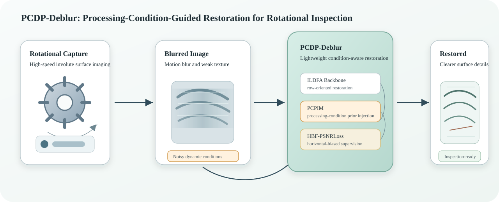

# PCDP-Deblur

**Processing-Condition Degradation Prior-Guided Deblurring for High-Speed Rotational Imaging of Involute Surfaces**

This repository is the official resource page for the research project on processing-condition-guided deblurring of high-speed rotational images of involute metallic surfaces.

> Code, trained models, and dataset access will be released after the paper is accepted.



## What This Project Addresses

High-speed rotational imaging is useful for industrial inspection because it can support gear-surface quality assessment, online monitoring, and remanufacturing evaluation without relying on slow static imaging. In practice, captured tooth-surface images often contain near-horizontal motion blur, metallic reflection changes, weak scratch textures, and trajectory disturbances caused by noisy dynamic processing conditions.

PCDP-Deblur is designed to restore such images by combining visual restoration with lightweight processing-condition prior information. The goal is to improve deblurring reliability while keeping the method suitable for industrial visual inspection workflows.

## Method Overview

PCDP-Deblur consists of three cooperating parts:

- **ILDFA**: an involute-surface lightweight direction-factorized architecture for row-oriented feature extraction, directional feature decoupling, and horizontal output correction.
- **PCPIM**: a processing-condition prior injection module that converts a blur-intensity prior into bounded, image-conditioned, stage-aware restoration guidance.
- **HBF-PSNRLoss**: a horizontal-biased frequency PSNR loss that complements spatial reconstruction supervision with frequency-domain emphasis on horizontal degradation patterns.

Together, these components form a lightweight restoration framework for high-speed rotational inspection images under noisy dynamic processing conditions.

## Planned Release

The repository is currently a pre-release resource page. After paper acceptance, the following resources are planned:

- Training and inference code.
- Configuration files for reproduction.
- Trained model checkpoints.
- Evaluation scripts for PSNR, SSIM, and inference time.
- Dataset access instructions with a Google Drive link.
- Dataset split files and metadata format documentation.

No code, checkpoints, or dataset files are included in this repository before the formal release.

## Dataset Access

The dataset will be distributed through a Google Drive link after the paper is accepted. The released documentation will include the image-pair organization, processing-condition prior format, and train/test split information.

## Citation

The citation will be updated after the paper is accepted.

```bibtex
@article{pcdp_deblur,
  title  = {Processing-Condition Degradation Prior-Guided Deblurring for High-Speed Rotational Imaging of Involute Surfaces},
  author = {To be updated},
  journal = {To be updated},
  year   = {2026}
}
```

## Contact

For questions about the project, please use the issue tracker after the resource release.
